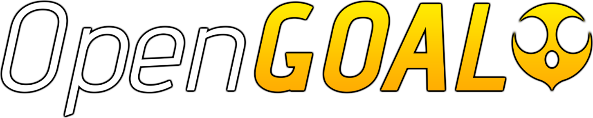
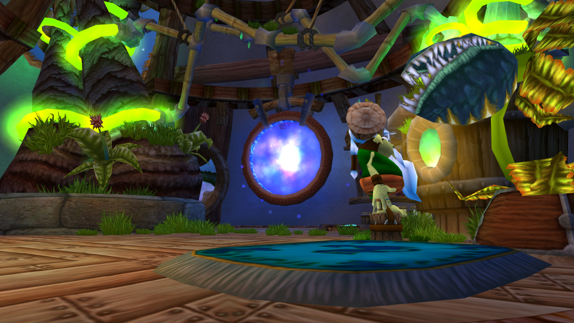
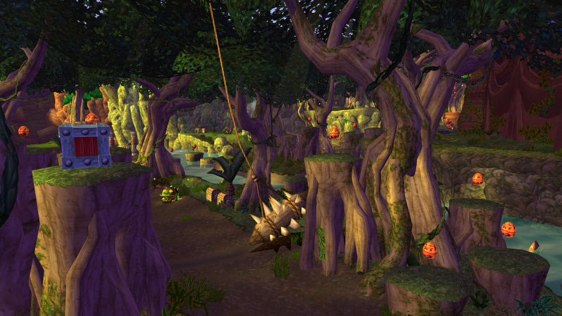

<p align="center">
  
</p>

<p align="center">
  <a href="https://opengoal.dev/docs/intro" rel="nofollow"></a>
  <a title="Crowdin" target="_blank" href="https://crowdin.com/project/opengoal"></a>
  <a target="_blank" rel="noopener noreferrer" href="https://github.com/open-goal/jak-project/actions/workflows/build-matrix.yaml"></a>
  <a href="https://www.codacy.com/gh/open-goal/jak-project/dashboard?utm_source=github.com&amp;utm_medium=referral&amp;utm_content=open-goal/jak-project&amp;utm_campaign=Badge_Grade" rel="nofollow"></a>
  <a href="https://discord.gg/VZbXMHXzWv"></a>
</p>

## Please read first <!-- omit from toc -->

> [!IMPORTANT]
> Our repositories on GitHub are for development of the project and tracking active issues. Most of the information you will find here pertains to setting up the project for development purposes and is not relevant to the end-user.

For a setup guide on how to install and play the game there is the following video that you can check out: https://youtu.be/K84UUMnkJc4

For questions or additional information pertaining to the project, we have a Discord for discussion here: https://discord.gg/VZbXMHXzWv

Additionally, you can find further documentation and answers to **frequently asked questions** on the project's main website: https://opengoal.dev

> [!WARNING]
> **Do not use this decompilation project without the use of your own legally purchased copy of the game.** OpenGOAL does not include any assets from the original games, so you must provide your own legitimately obtained PS2 copy of the game. OpenGOAL supports every retail PAL, NTSC, and NTSC-J build, including Greatest Hits copies. Please note that does NOT include any of the later releases (PS3/PS4/PS5).

- [Project Description](#project-description)
  - [Current Status](#current-status)
  - [Methodology](#methodology)
- [Setting up a Development Environment](#setting-up-a-development-environment)
  - [OS Setup](#os-setup)
  - [Editor Setup](#editor-setup)
  - [Building and Running the Game](#building-and-running-the-game)
    - [Extract Assets](#extract-assets)
    - [Build the Game (Running the Compiler)](#build-the-game-running-the-compiler)
    - [Run the Game](#run-the-game)
      - [Connecting the REPL to the Game](#connecting-the-repl-to-the-game)
      - [Running the Game Without Auto-Booting](#running-the-game-without-auto-booting)
- [Technical Project Overview](#technical-project-overview)

## Project Description

The project's goal is to port the original trilogy (Jak 1 -> Jak 3) to PC. Over 98% of the games were written in GOAL, a custom LISP language developed by Naughty Dog. Our strategy is:
- decompile the original game code into human-readable GOAL code
- develop our own compiler for GOAL and recompile the game code for x86-64
- create a tool to extract game assets into formats that can be easily viewed or modified
- create tools to repack game assets into a format that our port uses.

Our objectives are:
- make the port a "native application" on x86-64, with high performance. It shouldn't be emulated, interpreted, or transpiled.
- Our GOAL compiler's performance should be around the same as unoptimized C.
- try to match things from the original game and development as possible. For example, the original GOAL compiler supported live modification of code while the game is running, so we do the same, even though it's not required for just porting the game.
- support modifications. It should be possible to make edits to the code without everything else breaking.

At the moment we support **x86_64** on Windows, Linux and macOS (via Rosetta translation).  There are no plans to ever make a mobile release.

### Current Status

- Jak 1 has been considered in a polished, complete state for years at this point.
- Jak 2 is considered in beta due to a few issues we are aware of that need fixing, however to the casual user, the game is essentially complete.
- Jak 3 has a good amount of work left to do.




YouTube playlist showcasing some of the early progress for Jak 1:
https://www.youtube.com/playlist?list=PLWx9T30aAT50cLnCTY1SAbt2TtWQzKfXX

### Methodology

To assist with decompiling, we've built a decompiler that can process GOAL code and unpack game assets. We manually specify function types and locations where we believe the original code had type casts (or where they feel appropriate) until the decompilation succeeds, then we clean up the output of the decompiled code by adding comments and adjusting formatting, then save it in `goal_src/`.

Our decompiler is designed specifically for processing the output of the original GOAL compiler. As a result, when given correct casts, it often produces code that can be directly fed into a compiler and works perfectly. This is continually tested as part of our unit tests.

## SM64-Jak Integration (Jak in Super Mario 64)

This fork embeds Jak as a playable character inside SM64EX (the Super Mario 64 PC port). Jak replaces Mario using a shared library (`libjakopengoal`) that runs the GOAL VM headlessly and exposes Jak's state, collision, and rendering through a C API.

### Prerequisites

- **Windows 10/11** (x86_64)
- **MSVC** (Visual Studio 2019+ with C++ workload) for building the DLL
- **MSYS2/MinGW64** for building SM64EX
- **CMake** 3.16+
- A legally obtained **SM64 US ROM** (`baserom.us.z64`) placed in `sm64-jak/`
- A legally obtained **Jak and Daxter PS2 ISO** extracted into `iso_data/jak1/`

### Quick Build (Recommended)

Run the automated build script from the repo root:

```
build_sm64jak.bat
```

It will check prerequisites, build the DLL, copy dependencies, build SM64EX, and create a `launch_sm64jak.bat` for running the game. Each step has a Y/N prompt so you can skip what you've already built.

### Manual Build Steps

**1. Extract Jak assets and build OpenGOAL:**

```bash
task set-game-jak1
task set-decomp-ntscv1
task extract
task repl
# In the REPL, run: (mi)
```

**2. Build the libjakopengoal DLL (MSVC):**

```bash
cmake --build build --target jakopengoal --config Release
```

**3. Copy all DLLs to the SM64 build output directory:**

```bash
cp build/bin/Release/*.dll sm64-jak/build/us_pc/
```

**4. Build SM64EX with Jak integration (MSYS2/MinGW64 terminal):**

```bash
export PATH="/c/msys64/mingw64/bin:/c/msys64/usr/bin:$PATH"
cd sm64-jak
/c/msys64/usr/bin/env.exe TMPDIR=/tmp TMP=/tmp TEMP=/tmp OS=Windows_NT \
  /c/msys64/usr/bin/make.exe -j$(nproc) JAKOPENGOAL=1 WINDOWS_BUILD=1
```

### Running

```bash
cd sm64-jak/build/us_pc
export JAK_DATA_PATH="<path-to-jak-project>"
./sm64.us.f3dex2e.exe --skip-intro
```

Replace `<path-to-jak-project>` with the absolute path to this repository (use backslashes on Windows, e.g. `C:\Users\you\jak-project`).

### Blender Addons

The `libjakopengoal/blender/` and `libsm64-blender/` directories contain Blender addons for previewing Jak and SM64 characters. After building the DLLs above, copy them into the addon `lib/` directories before enabling the addons in Blender.

---

## Setting up a Development Environment (OpenGOAL)

The remainder of this README is aimed at people interested in building the OpenGOAL project from source, typically with the intention of contributing as a developer.

If this does not sound like you and you just want to play the game, refer to the above section [Quick Start](#quick-start)

### OS Setup

- [Windows](/docs/setup/system/windows.md)
- [Linux](/docs/setup/system/linux.md)
- [MacOS](/docs/setup/system/macos.md)
- [Docker](/docs/setup/system/docker.md)

### Editor Setup

You can of course use whatever editor you want, but here is some documentation that should help you get started on some of the editor's we have used and have written about:

- [Visual Studio (Windows)](/docs/setup/dev/vs.md)
- [Visual Studio Code](/docs/setup/dev/vscode.md)
- [Zed](/docs/setup/dev/zed.md)

### Building and Running the Game

Getting a running game involves 4 main steps:

1. Build C++ tools (follow Getting Started steps above for your platform)
2. Extract assets from the game
3. Build the game
4. Run the game

#### Extract Assets

First, we have to setup our environment so we know which game and version we are operating with. For the black label version of Jak 1 we would run the following:

```sh
task set-game-jak1
task set-decomp-ntscv1 # or for example for PAL, `task set-decomp-pal`
```

> Run `task --list` to see the other available options

Next, ensure you extract your ISO file contents into the relevant `iso_data/<game-name>` folder.  In the case of Jak 1 this is `iso_data/jak1`.

Once this is done, open a terminal in the `jak-project` folder and run the following:

```sh
task extract
```

#### Build the Game (Running the Compiler)

The next step is to build the game itself.  To do so, in the same terminal run the following:

```sh
task repl
```

You will be greeted with a prompt like so:

```sh
 _____             _____ _____ _____ __
|     |___ ___ ___|   __|     |  _  |  |
|  |  | . | -_|   |  |  |  |  |     |  |__
|_____|  _|___|_|_|_____|_____|__|__|_____|
      |_|
Welcome to OpenGOAL 0.8!
Run (repl-help) for help with common commands and REPL usage.
Run (lt) to connect to the local target.

g >
```

Run the following to build the game:

```sh
g > (mi)
```

> IMPORTANT NOTE! If you're not using the non-default version of the game, you may hit issues trying to run `(mi)` in this step. An example error might include something like:
>
> `Input file iso_data/jak1/MUS/TWEAKVAL.MUS does not exist.`
>
> This is because the decompiler inputs/outputs using the `gameName` JSON field in the decompiler config. For example if you are using Jak 1 PAL, it will assume `iso_data/jak1_pal` and `decompiler_out/jak1_pal`.  Therefore, you can inform the REPL/compiler of this via the `gameVersionFolder` config field described [here](./goal_src/user/README.md)

#### Run the Game

Finally the game can be launched.  Open a second terminal from the `jak-project` directory and run the following:

```sh
task boot-game
```

The game should boot automatically if everything was done correctly.

##### Connecting the REPL to the Game

Connecting the REPL to the game allows you to inspect and modify code or data while the game is running.

To do so, in the REPL after a successful `(mi)`, run the following:

```sh
g > (lt)
```

If successful, your prompt should change to:

```sh
gc>
```

For example, running the following will print out some basic information about Jak:

```sh
gc> *target*
```

##### Running the Game Without Auto-Booting

You can also start up the game without booting.  To do so run the following in one terminal

```sh
task run-game
```

And then in your REPL run the following (after a successful `(mi)`):

```sh
g > (lt)
[Listener] Socket connected established! (took 0 tries). Waiting for version...
Got version 0.8 OK!
[Debugger] Context: valid = true, s7 = 0x147d24, base = 0x2123000000, tid = 2438049

gc> (lg)
10836466        #xa559f2              0.0000        ("game" "kernel")

gc> (test-play)
(play :use-vis #t :init-game #f) has been called!
0        #x0              0.0000        0

gc>
```

## Technical Project Overview

Some more detail about the various components of the project can be found [here](/docs/project-overview.md)
